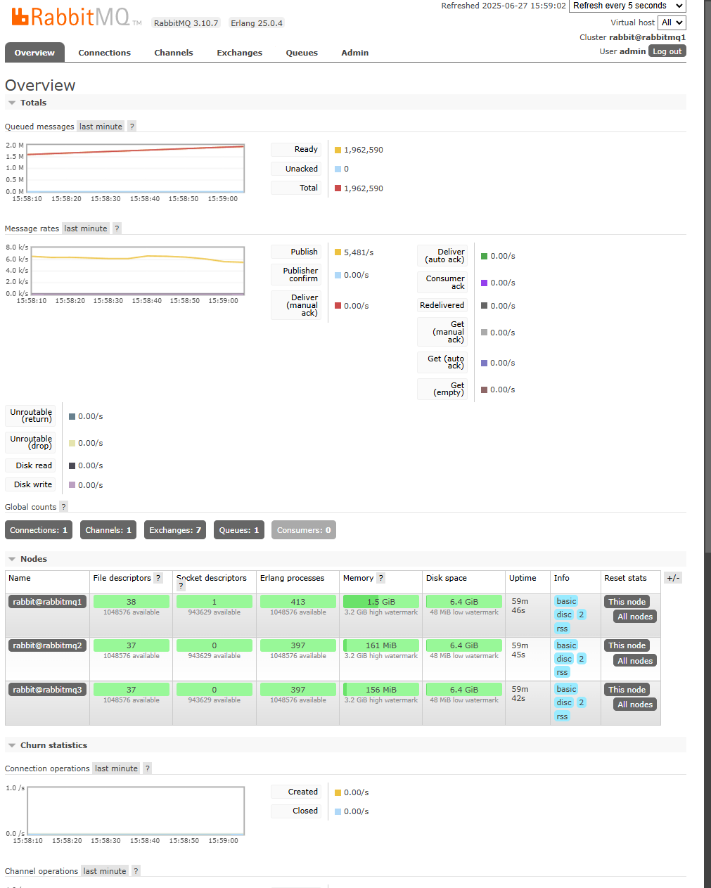
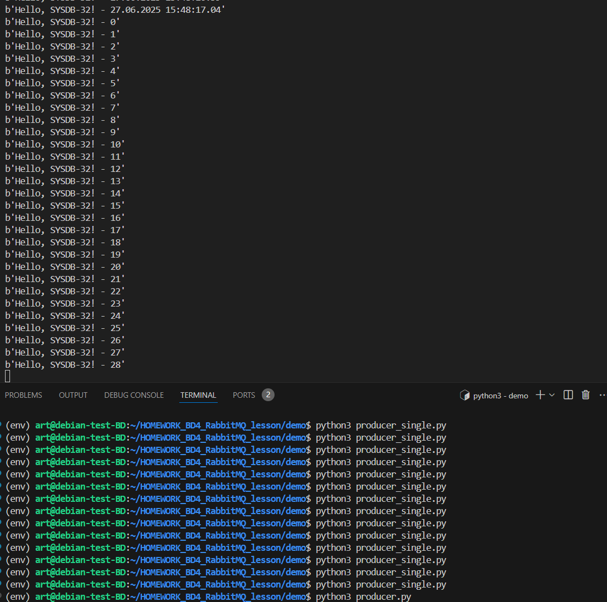

Можно взять готовый проект
https://github.com/ortariot/RabbitMQ-lession#


##  можно и поэтапно построить:

Создаем docker-compose_simple.yml

```
version: "3.8"

services:
  rabbitmq:
    image: rabbitmq:3.10.7-management
    hostname: rabbitmq1
    restart: always
    environment:
      - RABBITMQ_DEFAULT_USER=${RABBITMQ_DEFAULT_USER}
      - RABBITMQ_DEFAULT_PASS=${RABBITMQ_DEFAULT_PASS}
      - RABBITMQ_CONFIG_FILE=/config/rabbitmq
      - RABBITMQ_ERLANG_COOKIE=${RABBITMQ_ERLANG_COOKIE}
      - RABBITMQ_NODE_PORT=5672
    volumes:
      - ./config:/config
    ports:
      - 15672:15672
      - 5672:5672
```

```
mkdir -p config
```
rabbitmq.conf
```
loopback_users.guest = false
cluster_formation.peer_discovery_backend = rabbit _peer_discovery_classic_config
cluster_formation.classic_config.nodes.1 = rabbit@rabbitmq1
mnesia_table_loading_retry_timeout = 10000
mnesia_table_loading_retry_limit = 2|
```


создаем .env

```
RABBITMQ_DEFAULT_USER=admin
RABBITMQ_DEFAULT_PASS=123
RABBITMQ_ERLANG_COOKIE=12345
```


## Поднимаем одну ноду 
```
sudo docker compose -f docker-compose_simple.yml up -d
```


## Поднимаем кластер 

```
#version: "3.8"

services:
  rabbitmq:
    image: rabbitmq:3.10.7-management
    container_name: Rabbit_1
    hostname: rabbitmq1
    restart: always
    environment:
      - RABBITMQ_DEFAULT_USER=${RABBITMQ_DEFAULT_USER}
      - RABBITMQ_DEFAULT_PASS=${RABBITMQ_DEFAULT_PASS}
      - RABBITMQ_CONFIG_FILE=/config/rabbitmq
      - RABBITMQ_ERLANG_COOKIE=${RABBITMQ_ERLANG_COOKIE}
      - RABBITMQ_NODE_PORT=5672
    volumes:
      - ./config:/config
    ports:
      - 15672:15672
      - 5672:5672

  rabbitmq2:
    image: rabbitmq:3.10.7-management
    container_name: Rabbit_2
    hostname: rabbitmq2
    restart: always
    environment:
      - RABBITMQ_DEFAULT_USER=${RABBITMQ_DEFAULT_USER}
      - RABBITMQ_DEFAULT_PASS=${RABBITMQ_DEFAULT_PASS}
      - RABBITMQ_CONFIG_FILE=/config/rabbitmq
      - RABBITMQ_ERLANG_COOKIE=${RABBITMQ_ERLANG_COOKIE}
      - RABBITMQ_NODE_PORT=5672
    volumes:
      - ./config:/config

  rabbitmq3:
    image: rabbitmq:3.10.7-management
    container_name: Rabbit_3
    hostname: rabbitmq3
    restart: always
    environment:
      - RABBITMQ_DEFAULT_USER=${RABBITMQ_DEFAULT_USER}
      - RABBITMQ_DEFAULT_PASS=${RABBITMQ_DEFAULT_PASS}
      - RABBITMQ_CONFIG_FILE=/config/rabbitmq
      - RABBITMQ_ERLANG_COOKIE=${RABBITMQ_ERLANG_COOKIE}
      - RABBITMQ_NODE_PORT=5672
    volumes:
      - ./config:/config

```




Поппробуем нагрузить 

установим пакет 
```
apt install python3.11-venv
```
создадим виртуальное окружение 
```
python3 -m venv env
```
Затем активируйте его:
```
source env/bin/activate
```

установите моодуль ``pika`` через pip, но только после активации виртуального окружения:
```
pip install pika
```

или 
```
python3 -m pip install pika
```

```
python3 producer_single.py
```
в соседнем терминале 
```
source env/bin/activate
```
```
python3 consumer.py 
```


запустим неприрывный поток
python3 producer.py




создадим политику чтобы нагружалось 3 ноды


